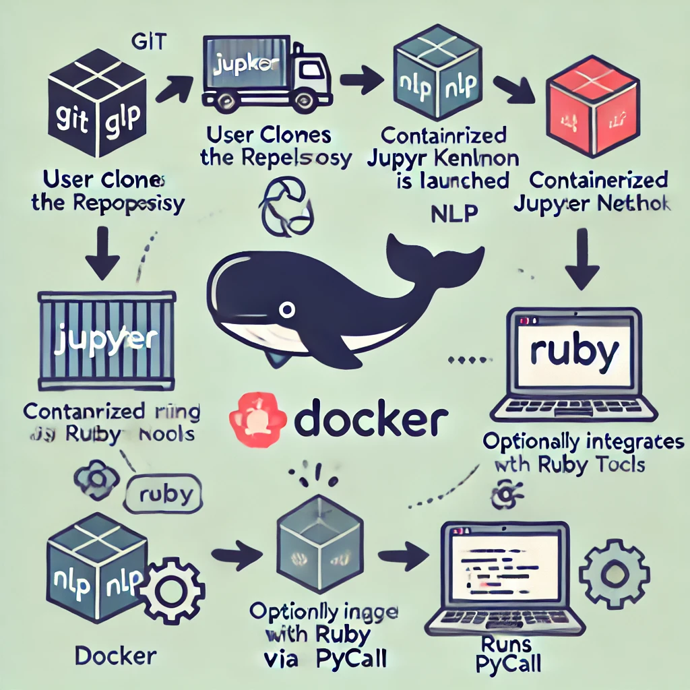

# Jupyter Notebook with Ruby Kernel & NLP Gems

[](https://github.com/b08x/jupyter-ruby-docker/actions/workflows/ci.yml)

Based on RubyData's [docker-stacks](https://github.com/RubyData/docker-stacks)

<div style="float: left; margin-right: 20px;">
  
</div>
This project provides a Docker image that bundles a Jupyter Notebook server preconfigured with a Ruby kernel (IRuby) and a comprehensive suite of RubyGems focused on Natural Language Processing (NLP) and language model utilities.

## Features

- **Ruby Kernel for Jupyter**: Use IRuby to run Ruby code interactively within Jupyter notebooks.
- **NLP Libraries**: Includes gems for text tokenization, sentiment analysis, entity extraction, and various language utilities.
- **Cross-Language Integration**: Leverage Python libraries from Ruby via [pycall](https://rubygems.org/gems/pycall) for mixed-language workflows.
- **Data Analysis**: Utilize gems like [daru](https://rubygems.org/gems/daru) and [daru-view](https://rubygems.org/gems/daru-view) for data manipulation and visualization.

## Prerequisites

- [Docker](https://www.docker.com/get-started) installed on your machine.
- Basic familiarity with Jupyter Notebooks and Docker commands.

## Installation

1. **Clone the Repository**

   ```bash
   git clone https://github.com/yourusername/your-repo.git
   cd your-repo
   ```

2. **Build the Docker Image**

   The provided `Dockerfile` uses a multi-stage build:
   
   - **Stage 1 (Builder):** Installs Ruby, build dependencies, and RubyGems listed in the `Gemfile`.  
   - **Stage 2 (Final Image):** Uses the [Jupyter minimal-notebook](https://quay.io/repository/jupyter/minimal-notebook) as the base, copies Ruby binaries and installed gems from the builder stage, and sets up runtime dependencies.

   To build the image, run:

   ```bash
   docker build -t jupyter-ruby-nlp .
   ```

3. **Verify Build**

   Once built, list your Docker images:

   ```bash
   docker images
   ```

## Running the Container

1. **Launch the Notebook Server**

   Run the container, mapping port 8888 to your host:

   ```bash
   docker run --rm -p 8888:8888 jupyter-ruby-nlp
   ```

2. **Access Jupyter**

   Open your browser and go to `http://localhost:8888`. The startup logs will display an authentication token—use it to log in.

3. **Using the Ruby Kernel**

   Within Jupyter, create a new notebook and select the Ruby kernel (IRuby). You can then run Ruby code and take advantage of the installed NLP gems.

## Usage Examples

- **IRuby Notebooks:** Start exploring Ruby-based data analysis and NLP tasks directly in your notebook.
- **Integrate Python:** With [pycall](https://rubygems.org/gems/pycall) installed, you can call Python libraries (e.g., spaCy for NLP) from your Ruby code.
- **NLP Pipelines:** Use gems such as [ruby-spacy](https://rubygems.org/gems/ruby-spacy) and [langchainrb](https://rubygems.org/gems/langchainrb) to build language processing pipelines and experiment with language models.

## Overview of Included RubyGems

Below is a brief description of some of the key RubyGems included in the Gemfile:

- **iruby**: Provides the Ruby kernel for Jupyter, enabling interactive Ruby sessions.
- **pycall**: Allows Ruby code to call Python functions and libraries, bridging the gap between Ruby and Python ecosystems.
- **ruby-spacy**: A Ruby wrapper for spaCy, offering NLP functionalities like tokenization, part-of-speech tagging, and dependency parsing.
- **langchainrb**: Offers utilities for building language model workflows, useful for tasks like chaining prompts and responses.
- **daru & daru-view**: Libraries for data analysis and visualization in Ruby.
- **fuzzy_tools & pragmatic_tokenizer**: Gems that facilitate text processing tasks such as fuzzy matching and tokenization.
- **Other Utilities**: Gems such as `open3`, `redis`, `jsonl`, and various `tty-*` packages support logging, concurrency, and terminal UI improvements.

For a complete list of the gems and their respective versions, please review the [Gemfile](./Gemfile).

## Customization & Development

- **Gemfile Updates**: To add or update RubyGems, modify the Gemfile and rebuild the image.
- **Kernel Patching**: The Dockerfile applies a patch to `ruby-spacy` (via `respond_to_missing.patch`)—customize this patch if needed for your setup.
- **Dockerfile Tweaks**: Adjust the Dockerfile as necessary (e.g., to add extra system packages or change configurations).

## Troubleshooting

- **Build Issues**: Verify that all build dependencies are available and that your Docker daemon has enough resources.
- **Kernel Registration**: If the Ruby kernel does not appear in Jupyter, ensure that `iruby register --force` ran successfully during the build.
- **Port Conflicts**: If port 8888 is already in use, modify the `docker run` command to map to a different host port.

## License

This project is licensed under the MIT License. See the [LICENSE](./LICENSE) file for details.

## Contributing

Contributions are welcome! Please fork the repository and submit pull requests for any improvements or bug fixes.